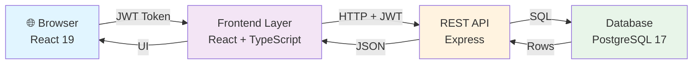
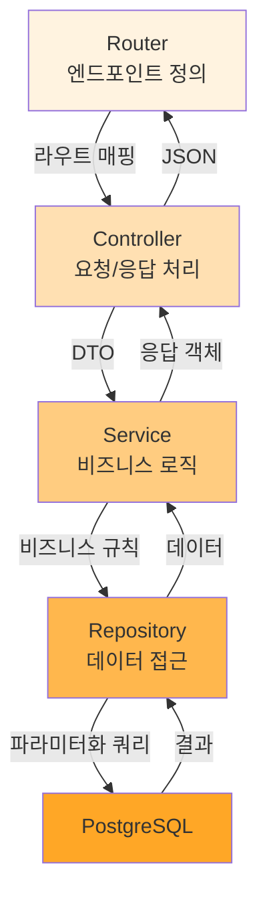
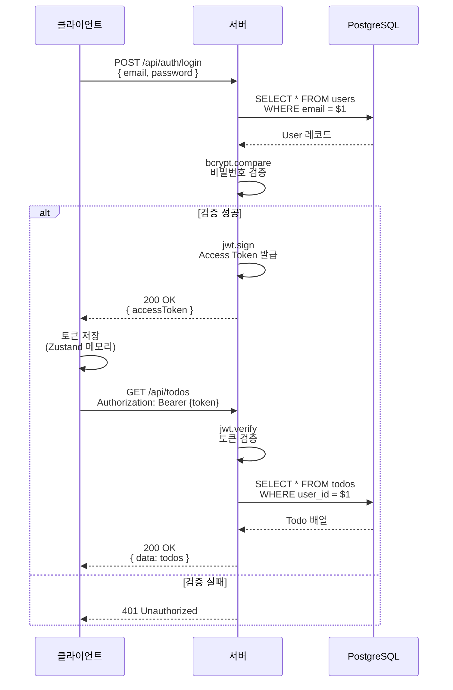
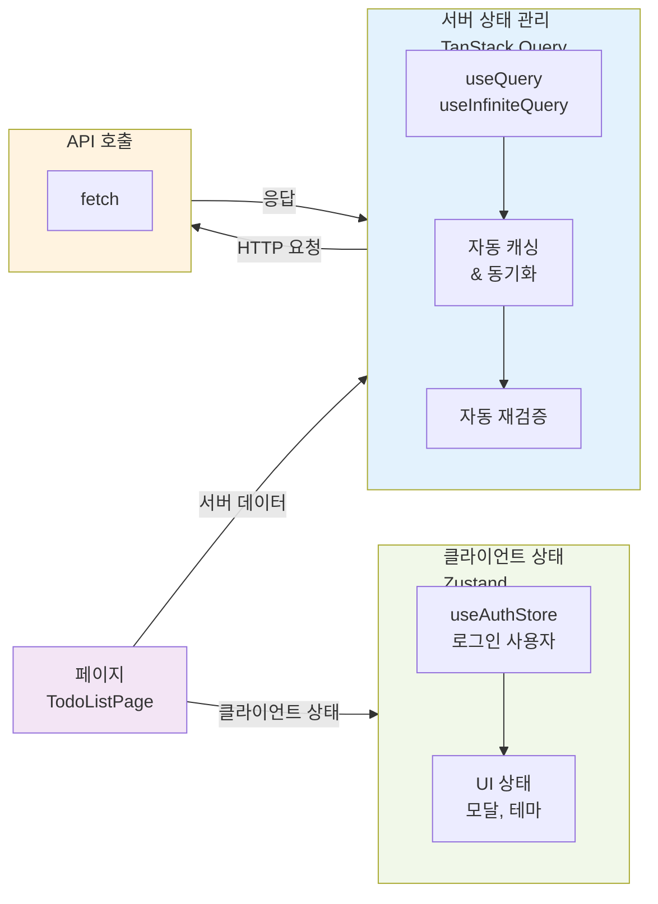

# TodoListApp 기술 아키텍처 다이어그램

## 문서 정보

| 항목 | 내용 |
|------|------|
| 버전 | 1.0 |
| 작성일 | 2026-05-13 |
| 작성자 | Documentation Engineer |
| 관련 문서 | [2-prd.md](./2-prd.md), [4-project-principles.md](./4-project-principles.md) |

---

## 1. 전체 시스템 구성

### 3-Tier 아키텍처



**핵심 포인트:**
- 프론트엔드는 REST API를 통해 백엔드와 통신
- JWT 토큰을 Authorization 헤더로 전달하여 인증
- 모든 데이터는 PostgreSQL에서 관리

---

## 2. 백엔드 레이어 구조

### 요청-응답 흐름



**레이어별 책임:**
- **Router:** HTTP 엔드포인트 정의, 미들웨어 연결
- **Controller:** 입력 검증, 비즈니스 로직 호출, 응답 포맷
- **Service:** 도메인 규칙 구현, 트랜잭션, 의사결정
- **Repository:** SQL 쿼리 실행, 파라미터화 쿼리로 SQL Injection 방지
- **DB:** 데이터 영속성, 제약 조건 관리

---

## 3. 인증 흐름

### 로그인 및 토큰 기반 요청



**핵심 포인트:**
- 비밀번호는 bcrypt로 해시되어 저장 (최소 10 라운드)
- JWT 토큰은 로그인 성공 시 발급
- 모든 인증 필요 API는 Authorization 헤더에서 토큰 검증
- 토큰 검증 실패 시 401 Unauthorized 반환

---

## 4. 프론트엔드 상태 관리

### TanStack Query vs Zustand 역할 분리



**상태 관리 전략:**
- **TanStack Query (서버 상태):** API 응답 캐싱, 자동 동기화, 백그라운드 재검증
- **Zustand (클라이언트 상태):** 로그인 사용자, UI 전역 상태 (다크모드, 모달)
- **컴포넌트:** 순수 렌더링, Props 기반 동작 (상태 관리 최소화)

---

## 5. 데이터 모델 관계도

### 테이블 및 FK 관계

```mermaid
erDiagram
    USERS ||--o{ CATEGORIES : "1:N"
    USERS ||--o{ TODOS : "1:N"
    CATEGORIES ||--o{ TODOS : "1:N"
    
    USERS {
        int id PK
        string email UNIQUE
        string password "bcrypt 해시"
        string name
        timestamp created_at
    }
    
    CATEGORIES {
        int id PK
        string name
        boolean is_default "기본 카테고리 여부"
        int user_id FK "NULL = 시스템 기본"
    }
    
    TODOS {
        int id PK
        int user_id FK
        int category_id FK
        string title
        string description
        date due_date "NULL 허용"
        boolean is_completed
        timestamp created_at
        timestamp updated_at
    }
```

**주요 특징:**
- `users` 삭제 시 `ON DELETE CASCADE` → 사용자의 모든 할일 및 카테고리 자동 삭제
- 기본 카테고리: `is_default = TRUE`, `user_id = NULL`
- 사용자 정의 카테고리: `is_default = FALSE`, `user_id = 특정 사용자`

---

## 기술 스택 요약

| 계층 | 기술 |
|-----|------|
| **프론트엔드** | React 19 + TypeScript |
| **상태 관리** | Zustand (클라이언트), TanStack Query v5 (서버) |
| **백엔드** | Node.js + Express (JavaScript/CommonJS) |
| **DB 클라이언트** | pg (node-postgres) |
| **데이터베이스** | PostgreSQL 17 |
| **인증** | JWT (jsonwebtoken) |
| **HTTP 로깅** | morgan |
| **애플리케이션 로깅** | winston |
| **API 문서** | swagger-ui-express (`/api-docs`) |
| **백엔드 테스트** | Jest + supertest |

---

## 변경 이력

| 버전 | 날짜 | 변경자 | 변경 내용 |
|------|------|--------|-----------|
| 1.0 | 2026-05-13 | Documentation Engineer | 최초 작성 - 4개 다이어그램 포함 |
| 1.1 | 2026-05-14 | Backend Developer | 기술 스택 요약 표에 morgan·winston·swagger-ui-express·Jest+supertest 추가 |
