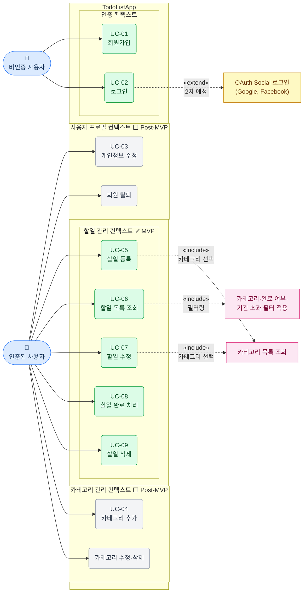

# TodoListApp Use Case Diagram

> 관련 문서: [2-prd.md](./2-prd.md) | [1-domain-definition.md](./1-domain-definition.md)

## 액터 정의

| 액터 | 설명 |
|------|------|
| 비인증 사용자 | 회원가입·로그인만 수행 가능한 미인증 상태의 사용자 |
| 인증된 사용자 | JWT 인증 후 할일·카테고리 전체 기능을 사용할 수 있는 사용자 |

---

## Use Case Diagram

---

## UC별 MVP / Post-MVP 분류

| UC ID | 유스케이스 | 액터 | 분류 | 관련 BR |
|-------|-----------|------|------|---------|
| UC-01 | 회원가입 | 비인증 사용자 | ✅ MVP | BR-01, BR-02 |
| UC-02 | 로그인 | 비인증 사용자 | ✅ MVP | BR-03 |
| UC-03 | 개인정보 수정 | 인증된 사용자 | ⬜ Post-MVP | - |
| UC-04 | 카테고리 추가 | 인증된 사용자 | ⬜ Post-MVP | BR-04, BR-05, BR-06 |
| UC-05 | 할일 등록 | 인증된 사용자 | ✅ MVP | BR-07, BR-08 |
| UC-06 | 할일 목록 조회 | 인증된 사용자 | ✅ MVP | BR-09 |
| UC-07 | 할일 수정 | 인증된 사용자 | ✅ MVP | BR-09 |
| UC-08 | 할일 완료 처리 | 인증된 사용자 | ✅ MVP | BR-10 |
| UC-09 | 할일 삭제 | 인증된 사용자 | ✅ MVP | BR-09 |
| — | 카테고리 수정·삭제 | 인증된 사용자 | ⬜ Post-MVP | BR-04, BR-05 |
| — | 회원 탈퇴 | 인증된 사용자 | ⬜ Post-MVP | - |
| — | OAuth Social 로그인 | 비인증 사용자 | 🔶 2차 확장 | - |

---

## 관계 설명

| 관계 | 대상 | 설명 |
|------|------|------|
| «include» | UC-05, UC-07 → 카테고리 목록 조회 | 할일 등록·수정 시 카테고리 선택을 위해 카테고리 목록을 반드시 조회함 |
| «include» | UC-06 → 필터 적용 | 할일 목록 조회 시 카테고리·완료 여부·기간 초과 필터가 항상 동작함 |
| «extend» | UC-02 → OAuth Social 로그인 | 로그인 화면에서 소셜 로그인 버튼 선택 시 OAuth 플로우로 확장 (2차 예정) |

---

## 변경 이력

| 버전 | 날짜 | 변경자 | 변경 내용 | 변경 사유 |
|------|------|--------|-----------|----------|
| 1.0 | 2026-05-13 | PM | 최초 작성 | PRD 기반 UC 다이어그램 작성 |
